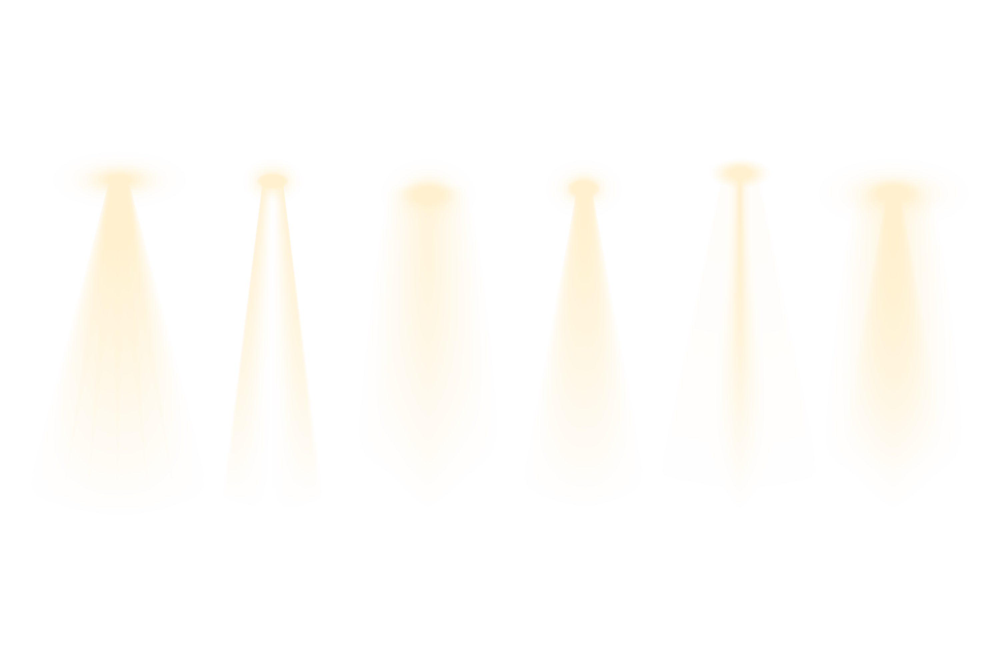

<h1>Hi, <strong style="color: white">I'm Mohamed Djebali</strong>, a <strong style="color: white">web developer</strong> 💻 from France 🇫🇷. I'm egyptian 🇪🇬 & tunisian 🇹🇳 too. </h1>

&nbsp;

<h2>Talking about Personal Stuffs :</h2>

<ul style = "padding : 10px">
    <li>👨🏽‍💻 I’m currently working on (https://recrute1developpeur.github.io/)</li>
    <li>🤓 I’m currently learning jS, Angular, Swift, Swift UI, PHP, Symfony...</li>
    <li>🤔 I’m looking for help GIT & GITHUB 😭;</li>
    <li>💬 Ask me about anything, I am happy to help;</li>
        <li>⚡️ Fun-Fact: I love video-games & drinking beers with friends;</li>
    <li>📫 How to reach me: djebali.mohamed88+github@gmail.com;</li>
</ul>

&nbsp;

<h2 style = "margin-bottom : 50px; padding: 5">Languages and Tools :</h2>

    
    
    
    
    
    
    
    
    

 <h2 style = "margin-bottom : 50px; margin-top: 50px;padding: 5">Completed projects :</h2>

  

 <ul style = "padding-left: 15px;">
     <li>✅ Project for psychologist =><a href = "https://maelie-richarte.fr/"> Here</a> </li>
    <li>✅ Handmade products by Raisin CERAMIC =><a href = "https://raisinceramic.com/"> Here</a></li>
    <li>✅ Group project : to learn more about ecology =><a href=""https://moregreen.fr/> Here</a></li>
 </ul>
